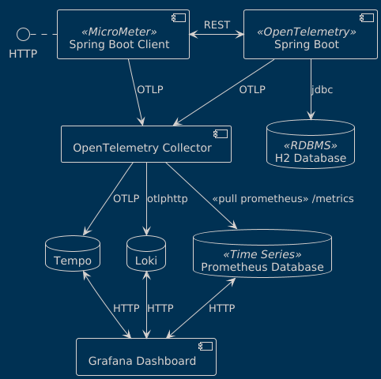

# Spring Boot OpenTelemetry POC

## Components



## How to run the infrastructure

```bash
cd podman
podman compose -f otel-compose.yml up
```

Then you can execute the two applications on their respective directories with

* springboot-demo (8080 port)

```bash
cd springboot-demo
mvn spring-boot:run
```

* springboot-client-demo (8081 port)

```bash
cd springboot-client-demo
mvn spring-boot:run
```

## Useful curl instructions

CPU load test
```bash
curl http://localhost:8080/fibo\?n\=45
```

Log test
```bash
curl http://localhost:8080/log
```

Trace test
```bash
curl http://localhost:8081/trace-demo
```